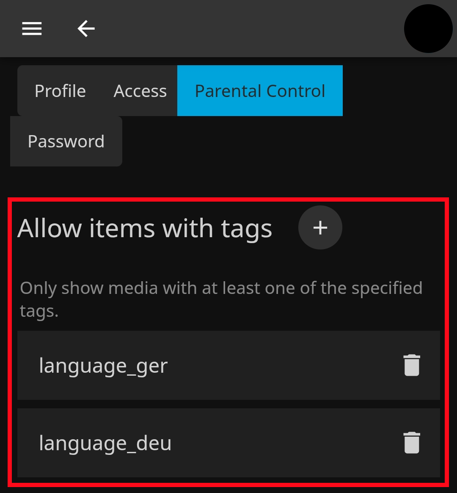

# 🍿 Jellyfin Language Tags Plugin 🌍
<p align="center">
  
</p>

## 📖 About
Jellyfin Language Tags Plugin is a .NET-based plugin that adds language tags to media files based on their audio tracks. It extracts language information from the audio tracks using FFmpeg. Language tags help users filter media in multilingual households, showing only content in their preferred language. It's also possible to add additional language tags based on the available subtitles including external ones.

## ✨ Features

- 🔄 Automatically scan the library with a scheduled job (default 24 hrs)
- 🎧 Create language tags from video's audio tracks via ffmpeg
- 💬 Create language tags from internal and external subtitles*
- 🏷️ Populate items and collections with language tags for easy filtering, whitelisting or backlisting
- 🎥 Works on movies, TV shows / series and collections
- ⚡ Runs asynchronously for speed and takes about 2 mins for a full refresh with ~ 500 movies
- 🐢 Synchronous mode for low-end devices like a Raspberry Pi
- 🧰 Force refresh options if media files are replaced or in case of problems

## 📚 Example Usage
Install the plugin and scan your library. Then, navigate to the parental controls of individual users and restrict content based on desired language tags. For example:
```
language_deu
language_ger
subtitle_language_deu
subtitle_language_ger
```
This setting will only display movies, TV shows, and collections that contain German audio tracks or german subtitles.

### 📱 Settings example on mobile
<p align="center">
  
</p>

## 🛠️ Installation
Add the following link to your jellyfin instance under Plugins -> Catalog -> Add Repository:
```
https://raw.githubusercontent.com/TheXaman/jellyfin-plugin-languageTags/main/manifest.json
```

## 🏗️ Build Process

1. Clone or download this repository.

2. Ensure that the .NET Core SDK is installed.

3. Build plugin with following command:

```sh
dotnet publish --configuration Release
```

4. Place the resulting file in the `plugins` folder.

<br>

---

<br>
  
\***NOTE FOR EXTERNAL SUBTITLES**: LanguageTags, looks for languages based on the subtitle's file name. If your subtitles are named with language identifiers longer than three characters `example: video.english.srt instead of video.eng.srt` the LanguageTags plugin may fail to generate tags successfully. Please rename your external files as per [Jellyfin specifications]([url](https://jellyfin.org/docs/general/server/media/movies/#external-subtitles-and-audio-tracks)). On Windows you can use Microsoft's [PowerRename]([url](https://learn.microsoft.com/en-us/windows/powertoys/powerrename)) and on Linux you can use the "rename" command.
