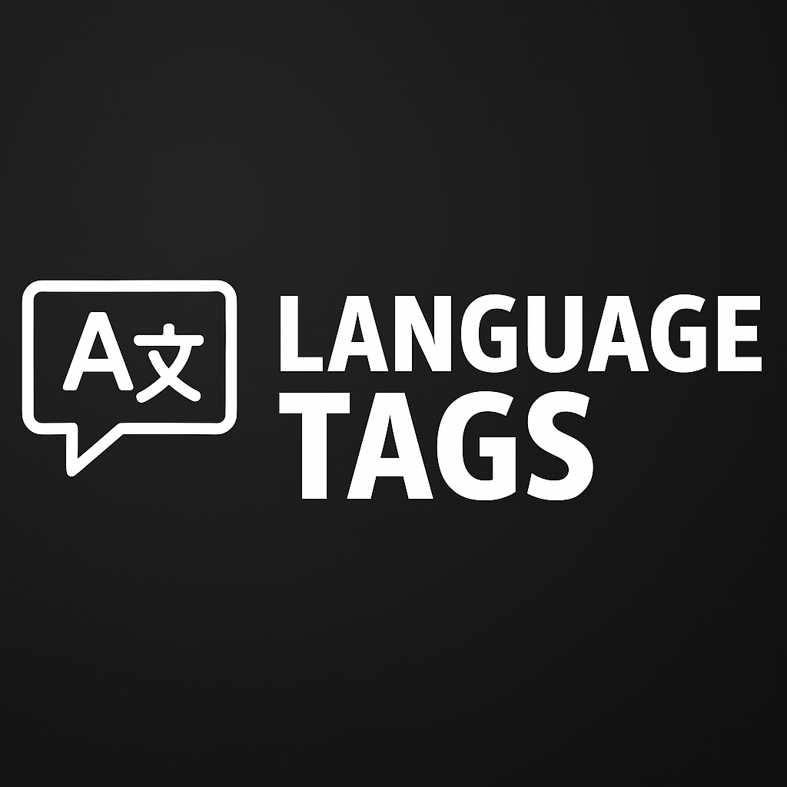

# Jellyfin Language Tags Plugin
<p align="center">
  
</p>

## About
LanguageTags helps handling multi-language content in a multi-lingual household, allowing administrators to deliver a per-user experience depending on the user spoken language(s).</br>
Another use case is to be able to retrieve a list of content that contains audio or subtitles in a specific language on the fly, essencialy enhancing the Jellyfin library's filter abilities.</br>
Currently, these are features that Jellyfin is not natively supporting and that are, otherwise, very difficult (or not at all possible) to achieve without this plugin.

## Details
The LanguageTags plugin adds tags to the items contained in your Jellyfin personal collection based on the language of the audio and subtitle tracks. This plugin will never modify the tags present in your actual media files, it will only create new tags which will be applied to the relevant "item" present in the Jellyfin's internal database. It uses Jellyfin’s MediaStreams API to read stream metadata directly (no FFmpeg), delivering a fast and reliable scan.</br>
Please note that LanguageTags will only work well if your media files are tagged correctly, so make sure that you use appropriate software to revise and flag the language of the audio and subtitle tracks contained in your videos. Also, internal and external subtitles are only supported if using "srt" and "ass" formats.

## Features
- Tagging & Display
  - Configurable tag prefixes for audio and subtitle tags (with validation)
  - Full language names in tags (e.g., language_German)
  - Visual language selector for easier configuration
  - Tagging for non-media items (e.g., actors, studios) with toggles*

- Operations
  - Automatic scheduled scan (default: 24h)
  - Works with movies, series (seasons/episodes), and collections
  - Asynchronous mode for speed; synchronous mode for low-end devices
  - Force refresh options when files are replaced or for troubleshooting
 
- Performance & Architecture
  - 10–100x faster scanning via MediaStreams API (no FFmpeg process spawn)
  - Direct extraction of audio/subtitle languages from metadata
  - External subtitle support for .srt and .ass

## Example Usage
Restrict content via user Parental Controls using the "Allow items with tags" rule in combination with LanguageTags:
```
language_German
subtitle_language_German
```
This shows only items that contain German audio tracks or German subtitles.

</br>

**TIP: if you want to easily find the language tags on the top of the alphabetical tag list, use a different prefix:

<p align="center">
  
</p>

### Parental Control screenshot
These are the possible Parental Control settings you could use for an English-only user:
<p align="center">
  
</p>

## Configuration
- Tag prefixes
  - Audio (default): language_
  - Subtitles (default): subtitle_language_
  - Validation ensures safe characters
- Non-media tagging
  - Enable tagging for actors, studios etc. if needed
- Scan mode
  - Asynchronous (default) or synchronous for low-end devices
- Schedule
  - Configure periodic scans (default every 24h)

## Installation
Add this repository in Jellyfin: Plugins -> Catalog -> Add Repository:
```
https://raw.githubusercontent.com/TheXaman/jellyfin-plugin-languageTags/main/manifest.json
```

## Build (only needed for development!)
1. Clone or download the repository
2. Install the .NET SDK >= 9.0
3. Build:
```sh
dotnet publish --configuration Release
```
4. Copy the resulting output to the Jellyfin plugins folder

## What’s New

### v0.4.4.8
- Performance & Architecture
  - Replaced FFmpeg with Jellyfin MediaStreams API (10–100x faster)
  - Removed FFmpeg process overhead, parsing code (~150 LOC), and IMediaEncoder dependency
  - Direct extraction of audio/subtitle languages from metadata
  - External subtitle support retained (.srt, .ass)
- Features
  - Configurable audio/subtitle tag prefixes with validation
  - Full language names in tags + visual language selector
  - Tagging for non-media items
  - Silent movies allowlist (whitelist) (#22)
- Improvements
  - Better ISO code conversion and language tag handling
  - Fallback handling for series when episodes reference seriesId directly
  - Improved logging for series/season queries
  - Less verbose LanguageTagsManager logs

### v0.5.1.0
- Features & Maintenance
  - Refactored core functionality into separate files
  - Enhanced series processing (split handling for seasons/episodes)
  - Improved logging and tracking of skipped items
  - Fewer database update calls for better performance
  - Code cleanup (removed dead code and unused external subtitle code)

---
## *NON-MEDIA ITEMS - Why would you want this?
Tagging non-media items (actors, directors, studios but, also, photo, photo-albums, album artists, music albums, etc.) is necessary in some cases.
If you want to use the Jellyfin "Allow" Parental Control rule, then you need to make sure that **everything** is properly tagged, otherwise Jellyfin will obscure several items.</br>
EXAMPLE:</br>
Say that you want a French user to be able to explore only the part of the catalgue that contains French audio or subtitles, then you'll be tampted to use only the following "Allow" rules:
```
#Audio_French
#Sub_French
```
But, by doing this, the French user will not be able to see the People's pages (director, actors, other cast members, etc.). Even more so, if your catalogue contains music, books or photos, these will be obscured, too. For this reason, LanguageTags implemented something called "non-media items" which, essentially, bulk tags with the tag "item" (which can be modified) everything that you decide to tag in the settings page. When running the daily shceduled task, LanguageTags will take care of all the newly created non-media items, too. So it is a set-and-forget feature that you'll only need to setup once.

Here's an example of how you could setup LanguageTags, so that the French user can now see all the non-media items, while still filtering non-French content:

<p align="center">
  
</p>

Then in the Parental Control Allow rules, make sure to add the following:
```
#Audio_French
#Sub_French
#item
```


---

### External Subtitles naming scheme

Note on external subtitles: Language detection for external subtitles relies on filename language identifiers. If your files use long names instead of short ISO codes (e.g., video.english.srt instead of video.eng.srt), detection may fail. Rename files per Jellyfin specs:
- Jellyfin specs: https://jellyfin.org/docs/general/server/media/movies/#external-subtitles-and-audio-tracks
- Windows (PowerRename): https://learn.microsoft.com/windows/powertoys/powerrename
- Linux (rename): https://wiki.archlinux.org/title/rename
